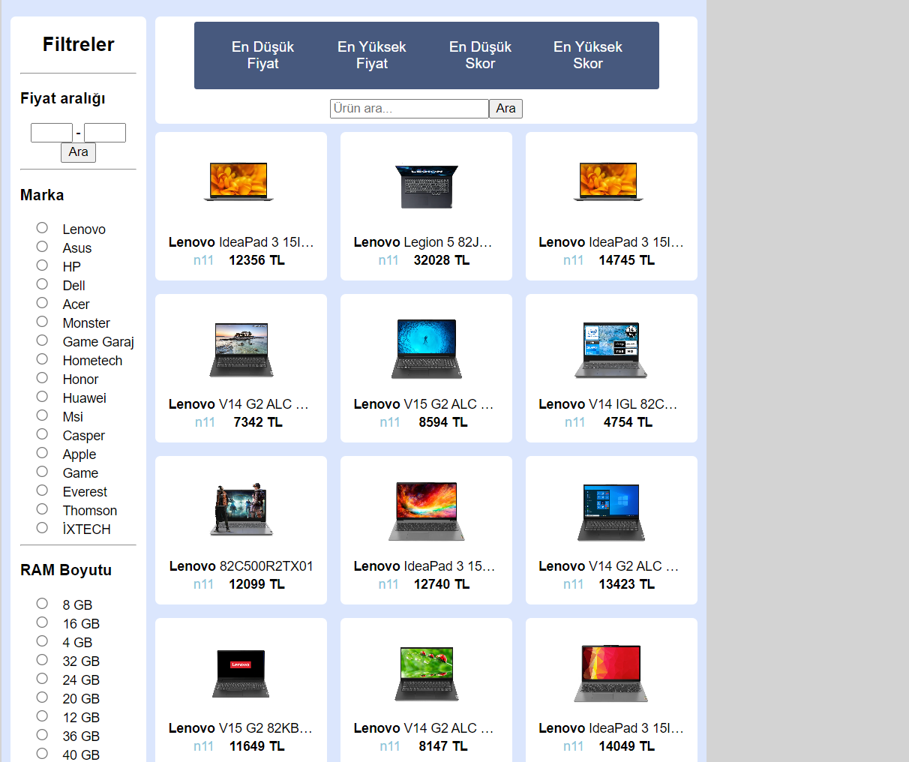

# E-Commerce App for Laptop Price Comparison

This project is a web app for comparing laptop prices that have been scraped from different Turkish e-commerce websites (specifically: n11, Vatan, Trendyol and Teknosa).

This project was developed as an assignment for Yazılım Laboratuvarı I course of the Computer Engineering programme in Kocaeli University.

### Table of contents
- [E-Commerce App for Laptop Price Comparison](#e-commerce-app-for-laptop-price-comparison)
    - [Table of contents](#table-of-contents)
  - [Overview](#overview)
  - [Usage](#usage)
    - [Installation](#installation)
    - [Running](#running)
  - [Other Information](#other-information)
    - [Technical Information](#technical-information)
    - [Developers](#developers)

## Overview

Scraped laptops can be viewed from the web app. Products can be categorized and listed in different ways (for example, from highest price to the lowest or *vice versa*) for browsing.

Users can also search for products by entering the model name of the product they desire to find in the product search bar.



Product information such as brand, RAM size, processor generation and operating system is scraped and stored, and can be viewed.


Data of products specifically belonging to the category of laptop computers is scraped from aforementioned websites, and then saved to a MySQL relational database. The scraper is run manually.

The web app is seperate from the scraper, and without a readymade product databse the scraper must be run first for the web app to function properly.

## Usage

### Installation

First, **node package manager (npm)** must be used to install the required packages for both client and the server.

In client and server folders seperately, run:

```
npm install
```

### Running

Like mentioned before, if a readymade database is not given, the scraper must be run first. To run the scraper, navigate to the server folder and run the following command:

```
node scraper.js
```

After the database is ready, run these commands in server and client folders, in that order:

```
npm start
```
```
node index.js
```

## Other Information

### Technical Information

The project was built using React.JS for the client side and Express.js framework of Node.js for the server side.

Puppeteer library for Node.js was used for the scraping process.

MySQL was used for the database.

### Developers

This project was developed as an assignment for Yazılım Laboratuvarı I course of the Computer Engineering programme in Kocaeli University.

Developers:
- Mahmut Bilgi
  - Github: [mahmutbilgi](https://github.com/mahmutbilgi)
- Özgür Hasan Ocak
  - Github: [ozgurocak](https://github.com/ozgurocak)